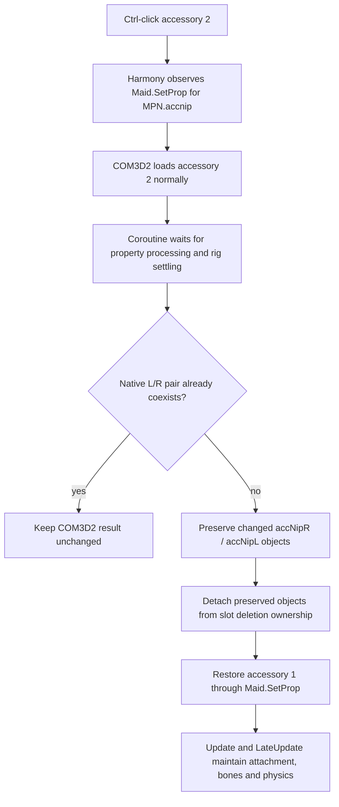
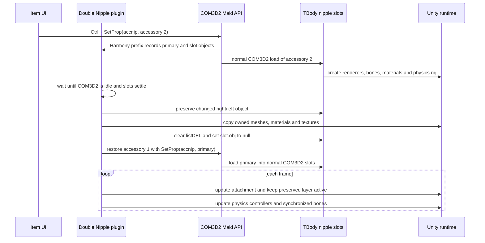
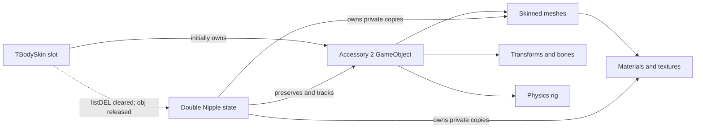
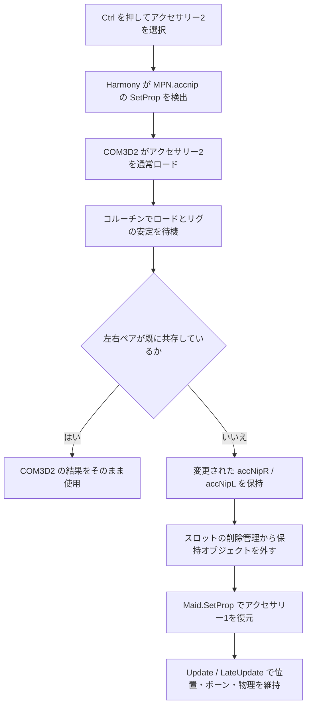
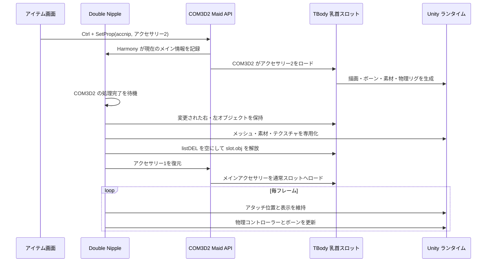
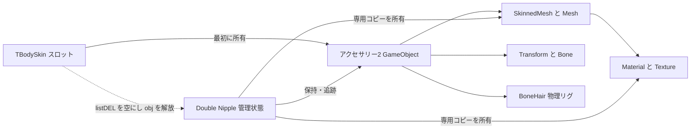

# COM3D2.DoubleNipple

A BepInEx plugin for COM3D2 that allows two nipple accessories to remain equipped at the same time, including two-sided and left/right-specific combinations.

## Requirements

- COM3D2 (64-bit)
- BepInEx 5

## Installation

[Download the latest release package](https://github.com/nanashi-187/COM3D2_Double_Nipple_Accessory/releases/latest)

Copy `COM3D2.DoubleNipple.dll` into:

```text
COM3D2/BepInEx/plugins/
```

Restart the game after installing or updating the plugin.

## Usage

1. Equip the first nipple accessory normally.
2. Hold `Ctrl` and select the second nipple accessory.
3. Use the game's normal selection flow to replace the primary accessory.

Holding `Ctrl` while clearing or resetting the nipple accessory also clears the preserved secondary accessory.

## Building

From PowerShell:

```powershell
.\build.ps1 -GamePath 'C:\Games\COM3D2'
```

The DLL is written to `bin/COM3D2.DoubleNipple.dll` by default. Visual Studio 2022 Build Tools and its Roslyn C# compiler are required.

## Notes

- The plugin does not modify game or mod asset files.
- Compatibility depends on the accessory's menu/model implementation. Report reproducible combinations with the BepInEx log.

## License

Nanashi-187 Non-Commercial No-Derivatives Software License 1.0. See `LICENSE` for the complete terms.

## Removing Accessory 2

Hold `Ctrl` and click the nipple category's unequip/none item. This removes accessory 2 while leaving accessory 1 equipped.

---

## 日本語

`COM3D2.DoubleNipple` は、COM3D2 で乳首アクセサリーを2つ同時に装着できるようにする BepInEx プラグインです。両側用アクセサリーと、左側・右側専用アクセサリーの組み合わせに対応しています。

### 必要環境

- COM3D2（64ビット版）
- BepInEx 5

### インストール

`COM3D2.DoubleNipple.dll` を次のフォルダーへコピーしてください。

```text
COM3D2/BepInEx/plugins/
```

インストールまたは更新後、ゲームを再起動してください。

### 使用方法

1. 1つ目の乳首アクセサリーを通常どおり装着します。
2. `Ctrl` キーを押しながら、2つ目の乳首アクセサリーを選択します。
3. 1つ目のアクセサリーを変更する場合は、通常どおり別のアクセサリーを選択します。

### 2つ目のアクセサリーを外す方法

`Ctrl` キーを押しながら、乳首アクセサリー一覧の「なし／解除」アイテムを選択してください。1つ目のアクセサリーを残したまま、2つ目だけを外します。

### ビルド

PowerShell から次のコマンドを実行します。

```powershell
.\build.ps1 -GamePath 'C:\Games\COM3D2'
```

既定では DLL が `bin/COM3D2.DoubleNipple.dll` に出力されます。Visual Studio 2022 Build Tools と Roslyn C# コンパイラーが必要です。

### 注意事項

- ゲーム本体や MOD のアセットファイルは変更しません。
- 互換性は各アクセサリーのメニューおよびモデル実装に依存します。
- 問題を報告する場合は、再現できるアクセサリーの組み合わせと BepInEx のログを添付してください。

---

## Architecture

### Why this plugin preserves a loaded layer

COM3D2 exposes one nipple property, `MPN.accnip`, backed by native right and left body slots (`TBody.SlotID.accNipR` and `accNipL`). Loading another nipple menu normally replaces objects in those slots. Reusing unrelated body slots caused conflicts, while a simple Unity `Instantiate` clone produced incorrect skinning, attachment, texture, and physics behavior for some accessories.

The plugin therefore lets COM3D2 load accessory 2 normally, preserves the resulting Unity hierarchy, removes that hierarchy from COM3D2's deletion ownership, and then asks COM3D2 to restore accessory 1.



### Equip sequence



### Unity object ownership

The object called a "clone" in telemetry is the already-loaded accessory-2 `GameObject`; the final architecture does **not** duplicate the entire hierarchy with `Instantiate`. Before COM3D2 restores accessory 1, the plugin:

1. Keeps the accessory-2 hierarchy and records its slot, transform, attachment, and skinning state.
2. Creates private copies of meshes, materials, referenced textures, and material property blocks so later COM3D2 cleanup cannot invalidate resources used by the preserved layer.
3. Rebinds `SkinnedMeshRenderer` bones and blend-shape weights.
4. Initializes COM3D2 `BoneHair2`, `BoneHair3`, or legacy `TBoneHair_` controllers when the model contains an internal dynamic rig.
5. Replaces `TBodySkin.listDEL` with an empty list and sets `TBodySkin.obj` to `null`, transferring practical lifetime ownership away from that slot before the primary accessory is restored.
6. Explicitly destroys the preserved hierarchy and its owned mesh/material/texture copies when accessory 2 is removed or replaced.



### Attachment and animation maintenance

`Update()` keeps each preserved layer active and follows COM3D2's native morph attachment point when available. If an accessory lacks that metadata, the plugin follows a persistent skinning bone or the corresponding live nipple slot while retaining the original offset. `LateUpdate()` runs after normal animation updates to advance supported hair/physics controllers and synchronize internal cloned bone transforms. This keeps the layer attached during breathing, posing, morphing, and gravity-driven movement.

Left/right-specific menus are handled per changed native slot. If COM3D2 already leaves a valid right/left directional pair loaded, the plugin avoids preservation and leaves the native result alone.

### Removal path

With `Ctrl` held, Harmony intercepts `SetProp` delete-menu filenames, `DelProp`, or `ResetProp` for `MPN.accnip`. The plugin destroys only its preserved secondary resources and suppresses that secondary-clear call, so COM3D2's primary accessory remains equipped.

### APIs used

| Layer | API | Purpose |
| --- | --- | --- |
| BepInEx | `BaseUnityPlugin`, `BepInPlugin`, `ManualLogSource` | Startup, frame callbacks, and telemetry |
| Harmony | `HarmonyPatch`, `HarmonyPrefix` | Observe or suppress nipple property operations |
| COM3D2 | `Maid.SetProp`, `DelProp`, `ResetProp`, `AllProcPropSeqStart` | Load, restore, and remove accessory state |
| COM3D2 | `MPN.accnip` | Nipple accessory property |
| COM3D2 | `TBodySkin`, `TBody.SlotID.accNipR/accNipL` | Native right/left model slots and cleanup ownership |
| COM3D2 | `BoneHair2`, `BoneHair3`, `TBoneHair_` | Dynamic accessory rig and gravity updates |
| Unity | `GameObject`, `Transform`, `Renderer`, `SkinnedMeshRenderer` | Hierarchy, attachment, and skinning |
| Unity | `Mesh`, `Material`, `Texture`, `MaterialPropertyBlock` | Independent rendering resources |
| Unity | coroutine, `Update`, `LateUpdate` | Wait for COM3D2 and maintain frame ordering |

## アーキテクチャ（日本語）

COM3D2 の乳首アクセサリーは1つのプロパティ `MPN.accnip` と、右用・左用の `accNipR`／`accNipL` スロットを使用します。新しいアクセサリーを読み込むと通常は同じスロットの既存オブジェクトが置き換えられます。

このプラグインは BepInEx から起動し、Harmony で `Maid.SetProp` などを監視します。`Ctrl` を押して2つ目を選ぶと、まず COM3D2 にアクセサリー2を通常どおり読み込ませます。コルーチンでモデル、ボーン、テクスチャおよび物理リグの初期化完了を待った後、変更された `accNipR`／`accNipL` の Unity 階層を保持し、アクセサリー1を `Maid.SetProp` で復元します。

最終方式では、アクセサリー階層全体を `Instantiate` で複製していません。COM3D2 が正しく生成したアクセサリー2の `GameObject` をそのまま保持し、メッシュ、マテリアル、テクスチャだけを専用コピーに差し替えます。さらに `TBodySkin.listDEL` を空にし、`TBodySkin.obj` を `null` にして、アクセサリー1の復元時に COM3D2 のスロット削除処理からアクセサリー2が破棄されないようにします。

毎フレームの `Update()` ではモーフのアタッチポイント、永続ボーン、または対応する乳首スロットを参照して位置・回転・スケールを維持します。`LateUpdate()` では COM3D2 の通常アニメーション後にボーン同期と `BoneHair2`／`BoneHair3`／`TBoneHair_` の更新を行い、呼吸、ポーズ変更、体型モーフおよび重力運動に追従させます。

左右専用アクセサリーは、実際に変更された右または左スロット単位で処理します。COM3D2 自体が有効な左右ペアを維持できている場合は、追加の保持処理を行わず、ネイティブの結果を使用します。

`Ctrl` を押しながら「なし／解除」を選ぶと、Harmony が削除用メニュー、`DelProp`、または `ResetProp` を検出します。プラグインが所有するアクセサリー2のオブジェクトと専用リソースだけを破棄し、アクセサリー1は COM3D2 の通常スロットに残します。

### 日本語ビジュアルガイド



上図は全体の装着フローです。プラグインはアクセサリー2を直接生成せず、まず COM3D2 に正規の方法でロードさせます。ロード完了後、その結果を保持してスロットの削除対象から外し、同じ `MPN.accnip` を使ってアクセサリー1を復元します。COM3D2 が左右専用アクセサリーを既に共存させている場合は、追加処理を避けます。



上図は COM3D2、プラグイン、Unity 間の呼び出し順序です。重要な点は、アクセサリー2のロードと初期化を COM3D2 に完了させてから保持処理を行うことです。これにより、MOD 固有のボーン構成、素材設定、重力処理をできるだけ正規状態のまま取得できます。



上図は Unity リソースの所有関係です。保持される `GameObject` は COM3D2 がロードした実物であり、階層全体を `Instantiate` したコピーではありません。ただし、後から COM3D2 が元スロットを掃除しても描画資源が消えないよう、メッシュ、マテリアル、テクスチャはプラグイン専用コピーにします。アクセサリー2を外す際は、これらの専用リソースも明示的に破棄します。
## Current Release Name / 現在のリリース名

The current BepInEx display name is **COM3D2 Double Nipple Accessory**, version **0.6.47**. The DLL filename and stable plugin GUID remain unchanged for upgrade compatibility.

現在の BepInEx 表示名は **COM3D2 Double Nipple Accessory**、バージョンは **0.6.47** です。アップグレード互換性を保つため、DLL ファイル名とプラグイン GUID は変更していません。

## License Update / ライセンス更新

Use is permitted only under the repository's **Nanashi-187 Non-Commercial No-Derivatives Software License 1.0**. See `LICENSE` for the complete terms.

利用条件は、リポジトリの **Nanashi-187 Non-Commercial No-Derivatives Software License 1.0** に従います。完全な条件は `LICENSE` を参照してください。
